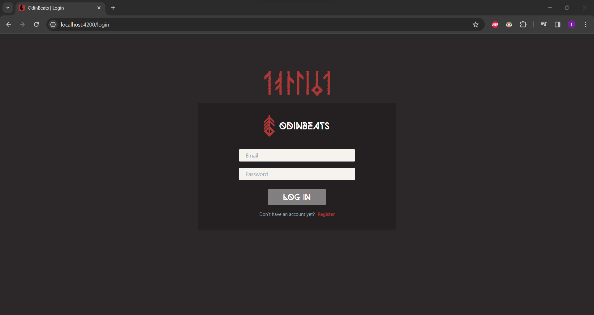
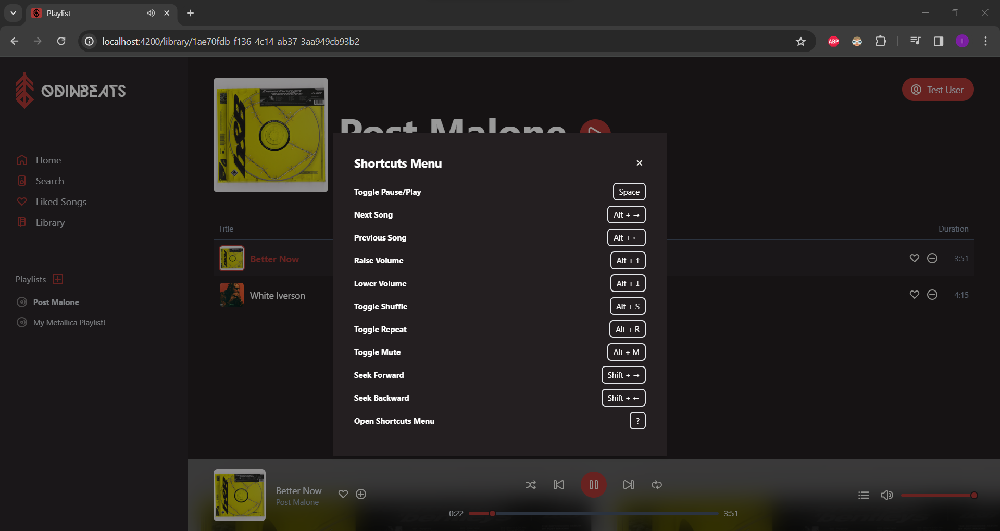

# OdinBeats Web App

OdinBeats is a music player web application built with Angular 17 and Tailwind CSS. It allows users to register, log in, and access various features such as browsing top songs, creating playlists, searching for songs, and controlling playback.

## Live Demo

You can explore a live demo of the OdinBeats Web App by visiting the following URL:

[OdinBeats Web App Demo](https://odinbeats-webapp.onrender.com)

N.B. This site and its API are both hosted on Render.com and it might take some time to start up and get responses from the API if it hasn't been used in a while.

## Features

- **Authentication**: Users can register and log in to access the application's features.
- **Home Page**: Displays sections for top songs, liked songs, and playlists.
- **Search**: Allows users to search for songs.
- **Liked Songs**: Displays a list of songs that the user has liked.
- **Playlists**: Allows users to create, edit, and delete playlists.
- **Playback Control**: Users can play, pause, skip, control volume, and view the playback queue.
- **Song Management**: Users can like/unlike songs and add/remove songs from playlists.
- **Shortcuts**: Pressing the `?` key opens a shortcuts menu for quick navigation.

## Setup

To run the OdinBeats web application locally, follow these steps:

1. Clone the repository:

   ```bash
   git clone https://github.com/rafieissam/odinbeats-webapp.git
   ```

2. Navigate to the project directory:

   ```bash
   cd odinbeats-webapp
   ```

3. Install dependencies:

   ```bash
   npm install
   ```

4. Start the development server:

   ```bash
   npm start
   ```

## Screenshots

### Login Page


### Home Page


### Search Page


### Search Page with Results


### Liked Songs Page


### Playlists Page


### Playlist Page


### Current Music Player Queue


### Shortcuts Menu


## My Todo List

- Responsive Design
- Toasts Messages (added/removed to playlist, liked/unliked)
- Login to have: `Show Password` icon

## Future Work

- **Artists and Albums**: Implement functionality to browse and view artists and albums.
- **Following**: Allow users to follow artists and receive updates.
- **Favorite Playlists**: Allow users to mark playlists as favorites.
- **Artist Page**: Create a dedicated page for each artist with biographical information and discography.
- **Album Page**: Create a dedicated page for each album with tracklist and album artwork.

## License

This project is licensed under the [MIT License](https://opensource.org/licenses/MIT) - see the [LICENSE](LICENSE) file for details.
